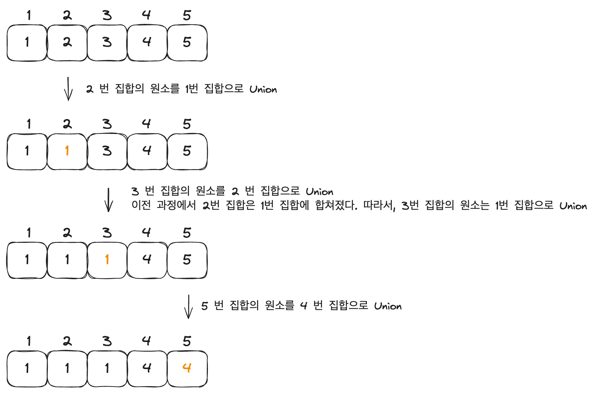
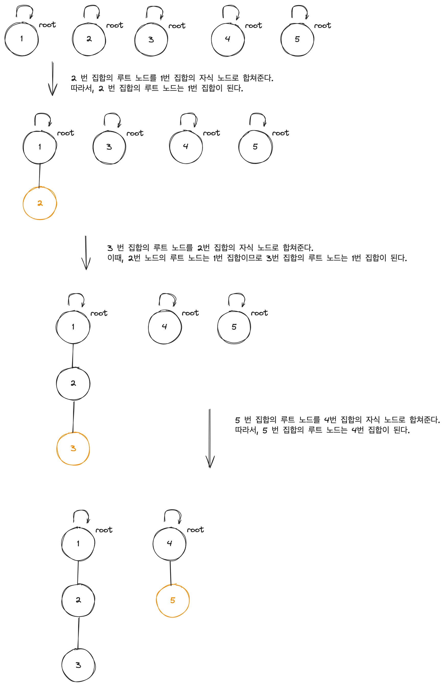

## Union-Find 알고리즘이란  

`Union-Find` 에 대한 개념에 대해서 이해하기 전에 `Disjoint Set` 자료구조에 대해서 먼저 이해해야 한다.  

### Disjoint set 이란  

`Disjoint set` 이란 **<U>서로 중복되지 않는 부분 집합</U>** 들로 나누어진 원소들에 대한 정보를 저장하고 조작하는 자료구조이다.  
다시 말해 공통 원소를 가지고 있지 않는, `상호 배타적` 인 부분 집합들로 나누어진 원소들에 대한 자료구조이다. `서로소 집합` 이라고도 부른다.  
  
Disjoint set 자료구조를 사용하면 서로 다른 원소들이 같은 집합에 속해있는지 혹은 속해있지 않은지 판별하는데 유용하다고 한다.  

Disjoint set 는 다음과 같이 3가지 연산을 지원해야 한다.  

- `Make-set(초기화)` : N 개의 원소가 각각 집합에 속하도록 초기화해야 한다.  
- `Union(합치기)` 연산 : 두 원소가 주어졌을 때 두 원소가 속한 집합을 하나로 합친다.  
- `Find(찾기)` 연산 : 어떤 원소가 주어졌을 때 해당 원소가 속한 집합을 반환한다.  

Union 연산과 Find 연산이 필요해 `Union-Find 알고리즘` 이라고 부르게 되었다고 한다.  

따라서 `Union-Find` 알고리즘이란 Disjoint set 자료구조를 표현할 때 사용하는 알고리즘이라는 것을 알 수 있다.  

알고리즘에서 사용할 집합을 구현하기 위해서는 벡터, 배열, 연결 리스트 등의 자료구조를 사용할 수 있지만 `트리 구조` 를 사용해야 효율적으로 구현할 수 있다.  

 

## Union-Find 알고리즘 이해하기  

위에서 Union-Find 를 구현하기 위해서는 `트리 구조` 를 사용하는 것이 가장 효율적이라고 말했다. 

배열을 사용하는 경우와 트리를 사용하는 경우에 대해서 왜 트리 구조가 더 효율적인지 이해해보자.  

### 배열을 사용해서 구현하기   

아래의 그림과 같이 각 원소가 집합 번호를 가지는 배열이 있다고 가정해보자.  

다음과 같이 `초기화` 연산을 통해 배열을 만들어준다.  

    

  
 
  
위의 배열에서 다음과 같이 `Union 연산` 을 수행해보았다.  

- 1번 집합과 2번 집합 합치기
    - 2번 집합에 있는 2번 원소의 집합을 1번 집합으로 합쳐준다.  
- 2번 집합과 3번 집합 합치기
    - 3번 집합에 있는 3번 원소를 2번 집합으로 합쳐준다.  
    - 이때 2번 집합은 이전 과정에서 1번 집합으로 합쳐졌기 때문에 1번 집합으로 합쳐져야 한다.  
- 4번 집합과 5번 집합 합치기
    -  5번 집합에 있는 5번 원소를 4번 집합으로 합쳐준다.  

 

  

위의 그림과 같이 두 집합을 합치기 위해서는 배열의 모든 원소를 찾아서 찾은 집합을 다른 집합 번호로 합쳐주어야 한다.  
따라서, 합칠 때마다 N 번 반복해주어야 하기 때문에 시간복잡도는 `O(N)` 이 된다.  

그럼 특정 원소가 속한 집합을 찾기 위해 `Find 연산` 을 수행한다고 하면 찾고자 하는 원소를 가지는 집합의 인덱스를 통해 찾으면되기 때문에 시간 복잡도는 `O(1)` 이 된다.  

 

    

 

이렇게 배열로 Union-Find 를 구현할 수 있지만 Union 연산을 수행할 때 모든 원소를 순회하기 때문에 시간 복잡도는 O(N) 이 된다.  
물론 Find 연산의 시간복잡도는 O(1) 로 빠르지만 트리 구조를 통해 더 빠른 Union 연산을 수행할 수 있다.  

 

### 트리 구조를 사용해서 구현하기 

배열과 달리 트리 구조를 사용해서 위에서 예를 들었던 Disjoint set 을 아래와 같이 표현할 수 있다.  

따라서, 아래와 같이 트리 구조를 통해 `초기화` 를 진행한다.  

 

  

트리 구조를 통해 연산을 수행하기 위해서 기본적으로 알아야 하는 내용이 있다.  

1. 한 집합에 속하는 원소들을 하나의 트리로 묶어준다.  
2. 트리 구조에는 루트 노드가 존재한다. 루트 노드가 집합의 번호가 된다.  
3. Union 연산을 수행하기 위해서는 두 원소가 같은 집합에 속하는지 먼저 확인한 후 다른 집합에 속할때만 합쳐야 한다.  
4. Find 연산을 수행하기 위해서는 모든 자식 노드가 부모에 대한 포인터 정보를 가지고 있도록 한다. 결과적으로 최종 부모인 루트 노드가 무엇인지 찾을 수 있게 된다. 여기서 부모 노드는 자식 노드에 대한 정보를 가질 필요는 없다.  

이와 같은 점들을 유의해서 Union 연산과 Find 연산을 해보도록 하자.  

먼저, `Union 연산` 을 수행해보자. Union 연산의 수행은 배열에서 진행했던 과정 그대로 진행하려고 한다.  

- 1번 집합과 2번 집합 합치기
    - 2번 집합의 루트 노드를 1번 집합의 자식 노드로 만들어준다.  
- 2번 집합과 3번 집합 합치기
    - 3번 집합의 루트 노드를 2번 집합의 자식 노드로 만들어준다.  
    - 이때, 2번 집합의 루트 노드는 1번 집합이므로 3번 집합의 루트 노드는 1번 집합이 된다.  
- 4번 집합과 5번 집합 합치기
    - 5번 집합의 루트 노드를 4번 집합의 자식 노드로 만들어준다.  

 

  

이렇게 트리 구조를 통해 Union 연산을 수행할 때 집합의 모든 원소를 다 찾을 필요없이 합치려고 하는 루트 노드를 찾아 합쳐주면된다.  
따라서, 시간 복잡도는 `O(N) 보다 작아` 지게 되고 Union 하는 과정에서 Find 연산을 통해 루트 노드를 찾기 때문에 Find 연산에 따라 시간복잡도가 달라지게 된다.  

이렇게 Union 연산을 합쳐진 트리 구조에서 `Find 연산` 을 하려면 찾는 원소의 포인터를 따라가 루트 노드를 찾으면 된다.  
이때, 시간복잡도는 `트리의 높이에 따라 비례` 하는 것을 알 수 있다.  

 

### 배열과 트리 비교

- **Union 연산 시간복잡도 비교**
    - 배열의 경우 원소만큼 N번 합쳐주어야 하기 해야하기 때문에 시간복잡도는 O(N) 이 된다.
    - 트리의 경우 루트 노드를 다른 집합의 자식 노드로 합쳐주면 되기 때문에 시간복잡도는 O(N) 보다 작게 된다.

- **Find 연산 시간복잡도 비교**
    - 배열의 경우 특정 원소의 집합을 찾으면 바로 집합을 찾을 수 있기 때문에 시간복잡도는 O(1) 이 된다.
    - 트리의 경우 특정 원소의 집합을 찾으려면 원소가 포함된 트리의 루트 노드를 찾아야 하기 때문에 시간복잡도는 트리의 높이에 비례한다.  

 

## Union-find 최적화

위와 같이 Union-Find 알고리즘을 통해 연산을 수행해봤는데 트리 구조를 사용하는 경우에 큰 문제가 발생할 수 있다.  

최악의 경우 완전 비대칭 트리가 되어 버리면 N 개의 노드가 있을 경우 트리의 높이가 N-1 인 연결 리스트와 같은 트리 구조가 되어 Find 연산의 시간복잡도가 O(N) 이 되어 버린다.  
그래서 최악의 경우 트리 구조를 사용했을 경우 배열보다 비효율적이게 된다.  

    

  

따라서 이와 같은 문제가 발생하면 다음과 같이 **두 가지 최적화 방법**을 통해 방지할 수 있다.  

### Union 연산 최적화

Union 연산을 최적화 하는 방법으로 `union-by-rank` 가 있다.  
Union 연산을 수행하는 과정에서 **<U>항상 높이가 더 낮은 트리를 높은 트리 밑에 넣어준다.</U>**  

쉽게 말해서 자식 노드가 추가되면 루트 노드의 rank 가 증가하게 되고 rank 가 작은 노드가 rank 가 큰 노드의 자식 노드가 된다.  
이와 같은 방법으로 트리의 높이가 높아지는 현상을 방지할 수 있다고 한다.  

두 트리의 크기를 비교하기 위해 rank 를 사용하게 되는데 여기서 주의해야할 점은 rank 가 height 이 아니라는 점이다.  

 

### Find 연산 최적화

Find 연산을 최적화 하는 방법으로 `경로 압축 (Path Compression)` 이 있다.  
Find 연산을 수행할 때 포인터를 통해 루트 노드를 찾는 과정에서 트리의 높이에 비례해서 연산을 수행하게 된다.  
이러한 과정에서 루트 노드를 찾고자 하는 집합 노드의 루트 노드로 만들어 찾는 과정에서 중간 노드를 생략하는 방법이라고 할 수 있다.  
따라서 중간 노드가 생략되어 버리기 때문에 경로가 압축되었다고 할 수 있다.  

 

위의 이미지와 같이 경로를 압축해 2번 집합이나 3번 집합 둘 다 1번 집합을 루트 노드로 되어있기 때문에 3번 집합의 경우 2번 집합을 거치지 않아도 된다는 점을 통해 루트 노드를 찾는 경로를 압축시켜버렸다. 
그 결과 트리의 높이가 2 에서 1 로 낮아지게 되어 더 빠르게 찾을 수 있다.   

 

결과적으로 두 가지의 최적화 방법을 사용하면 트리 구조의 Union-Find 알고리즘의 시간복잡도를 `O(h)` 에서 `O(logN)` 으로 줄일 수 있다고 한다.  

 

## Union-Find 알고리즘 관련 문제

- [백준 온라인 저지 1043번](https://www.acmicpc.net/problem/1043)
- [백준 Union-Find 공개 문제집](https://www.acmicpc.net/workbook/view/900)
- [Leetcode Union Find 문제 모음](https://leetcode.com/tag/union-find/)

 

## 참고 레퍼런스
https://gmlwjd9405.github.io/2018/08/31/algorithm-union-find.html  
https://yoongrammer.tistory.com/102  
http://bowbowbow.tistory.com/26  
