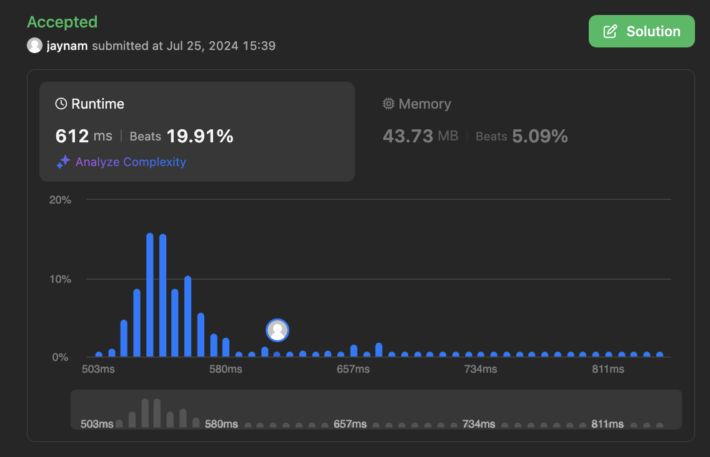
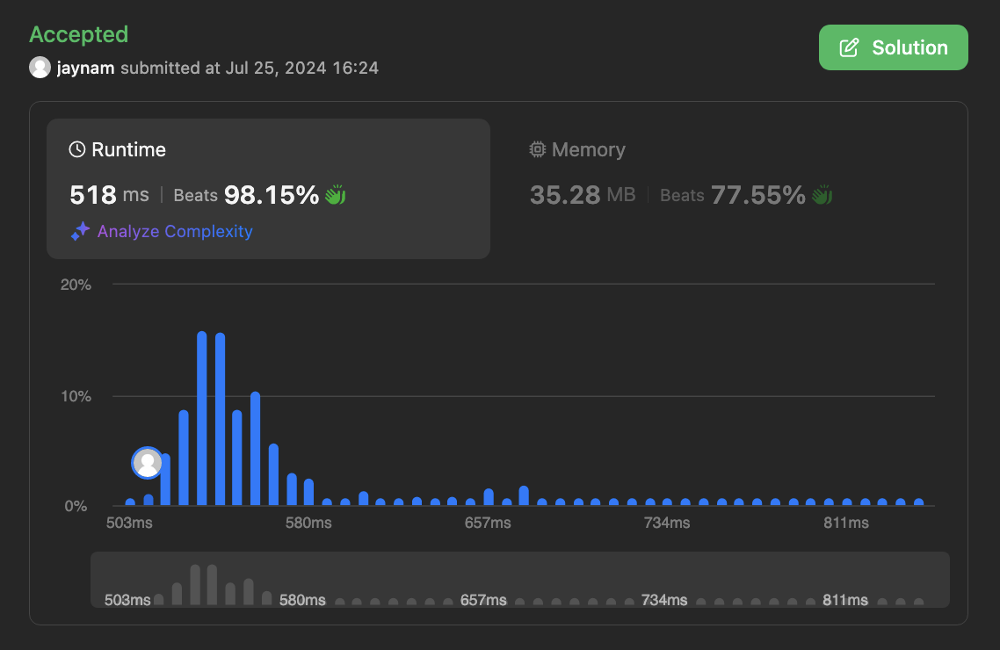

## 문제 링크

https://leetcode.com/problems/the-latest-time-to-catch-a-bus/

<br>

## 문제 요약

버스 출발 시간인 `buses` 와 승객의 도착 시간인 `passengers` 가 정수형 배열로 주어진다. 버스 출발 시간과 승객의 도착 시간은 고유한 값을 가지고 있어 중복되지 않는다.
그리고 버스에 탑승할 수 있는 승객의 수인 `capacity` 가 주어진다.  

승객이 도착하게 되면 버스 정류장에서 줄을 서게 된다. 이때, 온 순서 대로 버스를 타게 된다. 그리고 버스 도착 시간 전에 도착한 승객만 버스에 탑승할 수 있다.  

버스가 도착할 경우 다음과 같은 과정을 거치게 된다.  

- 버스의 수용 인원에 맞게 승객을 태운다.  
- 먄약, 일찍 온 승객이 버스에 탑승하지 못했다면 다음 버스를 먼저 탈 수 있다.  


이와 같은 과정을 통해 버스를 탑승한다고 했을 때 **<U>버스를 탈 수 있는 시간 중에서 가장 늦은 시간</U>** 을 구하면 된다.  
단, 다른 승객과 도착 시간이 겹칠 수 없다. 만약, 19분에 도착한 승객이 있다면 19분에는 다른 승객과 도착 시간이 겹치게 되어 19분에는 도착하면 안된다.  


<br>

## 문제 풀이

### 예제 분석하기 

문제는 어느 정도 이해했지만 먼저 예제를 통해 다시 이해해 보았다.  

```python
Input: buses = [20,30,10], passengers = [19,13,26,4,25,11,21], capacity = 2
Output: 20
```

위와 같이 예제가 주어진다고 가정하고 그림을 그려가며 이해하려고 했던 것 같다.  

#### CASE 1

가장 먼저 배열을 보면 정렬이 되어있지 않기 때문에 정렬을 먼저 해주었다.  

```python
buses = [10,20,30]
passengers = [4,11,13,19,21,25,26]
capacity = 2
```

그럼 승객이 버스를 탑승하게 되는 경우에 대해서 다음과 같이 그려볼 수 있다.  

<br>


<br>

그럼 내가 가장 늦게 도착해도 버스를 탈 수 있는 시간은 언제가 될까? 

먼저, 가장 늦게 버스를 탑승한 승객의 도착 시간인 `21분` 보다는 빠릴 도착해야 한다. 따라서, `20분` 에 도착하게 되면 마지막 버스에 마지막으로 탑승할 수 있게 된다.  

따라서, 다음과 같이 `20분`에 도착하면 비어있는 도착 시간 중에서 버스를 탈 수 있는 가장 늦게 버스를 탈 수 있다.  

<br>


<br>

하지만 지금과 같은 경우는 가장 이상적인 경우였기 때문에 다른 경우들도 살펴봐야 한다.  

#### CASE 2

그래서 또 하나의 예를 가져와봤다.  

```python
Input: buses = [3], passengers = [2,4], capacity = 2
Output: 3
```

이 경우에는 버스의 수용 인원이 2명이지만 1명 밖에 타지 못해 다음과 같이 `3분` 에 도착하면 버스를 탈 수 있다.  

이렇게 마지막 버스에 자리가 남는 경우도 생각해주어야 한다.  

<br>

<div style="padding: 0 250px;">
    
</div>

<Br>

#### CASE 3

또 다른 케이스의 경우를 살펴보자.  

```python
Input: buses = [18,8,3,12,9,2,7,13,20,5], passengers = [13,10,8,4,12,14,18,19,5,2,30,34], capacity = 1
Output: 11
```

이 경우에는 도착 시간이 겹칠 수 없어 겹치지 않는 시간을 찾아야만 한다. 정렬을 해주게 되면 다음과 같다.  

```python
buses = [2,3,5,7,8,9,12,13,18,20]
passengers = [2,4,5,8,10,12,13,14,18,19,30,34]
capacity = 1
```

버스와 승객의 수가 너무 많아 한 눈에 보기 어려워 그림으로 그려서 확인해봤다.  

<br>

 

<br>

위의 그림을 보았을 때 가장 늦게 버스에 탑승한 시간이 `14분` 이다. 그럼 13분에 도착할 수 있는지 확인해보니 13분에 다른 승객이 이미 도착해있다. 그리고 12분 도 마찬가지인 것을 확인할 수 있어서 결국에는 `11분` 에 도착해야 가장 늦게 버스를 탈 수 있는 시간이 된다.  

<br>

 

<br>

이와 같이 예제를 분석해봤을 때 몇 가지 확인하고 넘어가야 하는 부분이 생겼다.  

- **가장 늦게 버스에 타는 승객의 시간을 가져오면 된다.**  
- **가장 늦게 버스에 타는 승객의 시간부터 도착 시간을 확인하는데 다른 승객과 시간이 겹친다면 마지막 버스가 아닌 이전 버스를 타야 한다.**  
- **마지막 버스에 탑승할 수 있는 자리가 비어있다면 버스가 도착하는 시간까지 생각해야 한다.**  

<br>

결국에는 마지막에 버스에 탄 승객의 시간을 가져오는 것이 중요하고 마지막 버스에 자리가 남아있다면 버스가 도착하는 시간에 맞춰 도착할 수 있다.  

이와 같은 조건들을 생각해서 문제를 풀어보았다.  

<br>

### 최적화 하기 전 코드 작성

먼저 정렬이 되어 있지 않은 버스와 승객의 배열을 정렬시켜 주었다.

```python
buses = sorted(buses)
passengers = sorted(passengers)
```

다음으로 버스에 누가 탑승했는지 알고 싶어 dictionary 를 하나 만들어주었다.  

```python
buses_dict = {bus:[] for bus in buses}
```

다음으로 각 인덱스의 포인터를 지정해주었다.  

```python
cur_b = 0
cur_p = 0
cur_c = 0
```

추가로 마지막 승객의 위치를 저장할 변수도 생성해주었다.  

```python
last_passenger = 0
```

그리고 이제 마지막 승객이 어디있는지 확인을 하기 위해서 버스와 승객의 배열을 가져와 조건을 통해 승객이 버스에 탑승하는 과정을 적어주었다.  

```python
while cur_b < len(buses) and cur_p < len(passengers):
    if cur_c == capacity:
        cur_b += 1
        cur_c = 0
    else:
        # 버스보다 빨리 도착해있으면 버스 탑승
        if passengers[cur_p] <= buses[cur_b]:
            buses_dict[buses[cur_b]] += [passengers[cur_p]]
            last_passenger = passengers[cur_p]
            cur_p += 1
            cur_c += 1
        else:
            cur_b += 1
            cur_c = 0
```

while 문 조건으로는 버스가 가득 차거나 승객이 다 타는 경우 종료되도록 설정했고 승객이 탑승하게 되면 수용 인원을 증가시켜주었고 버스가 가득차게 되면 0으로 초기화 시켜주고 다음 버스로 변경해주었다.  

이때 버스에 탑승하는 승객이 있다면 아까 만든 딕셔너리에 해당 버스에 승객을 추가해주고 마지막 승객의 도착 시간을 갱신해주었다.  

그렇게 모든 승객이 버스에 탑승하게 되면 마지막 버스에 자리가 빌 경우를 대비해서 다음과 같이 마지막 도착 시간을 버스가 도착하는 시간으로 한 번 더 확인해주었다.  

```python
 if len(buses_dict[buses[-1]]) < capacity:
    last_passenger = buses[-1]
```

그럼 이제 마지막 승객이 탑승한 시간부터 하나씩 감소시켜주면서 가장 늦게 탈 수 있는 시간을 구해주면 된다.  

```python
for time in range(last_passenger, -1, -1):
    if passengers.count(time) == 0:
        lastest_time = time 
        break

return lastest_time
```

이렇게 해서 통과할 수 있었는데 실행 속도는 거의 꼴등에 가까웠고 메모리도 거의 최대로 사용해서 풀었다.  

그래서 다시 최적화 작업을 거쳐주었던 것 같다.  

<br>

### 코드 최적화하기

최적화 하는 과정에서 최적화를 할 수 있는 부분이 무엇이 있을까 고민하다보니 다음과 같이 정리가 되었다.  

- 마지막 승객의 탑승 시간만 가지고 있으면 되기 때문에 딕셔너리를 사용해서 모든 버스의 승객을 기록할 필요가 없다.
    - 버스 별 승객을 저장하는 딕셔너리가 필요하지 않다.

- 버스와 승객을 동시에 처리해주고 있는데 구분해서 동시에 작업하지 않아도 되고 버스에 승객만 태우고 마지막 승객의 위치만 기억하고 있으면 된다.  
    - 따라서 버스는 따로 처리할 필요 없이 승객만 버스에 타는 과정에 대해서 처리해주면 된다.  
```python
cur = 0

for bus in buses:
    cap = capacity

    while cap > 0 and cur < len(passengers) and passengers[cur] <= bus:
        cap -= 1
        cur += 1
```

- 버스의 수용 인원을 늘려주지말고 수용 인원에서 승객이 탑승할 경우 하나씩 줄여준다.  
    - 마지막 버스에 자리가 빈다면 수용 인원이 0보다 클 경우만 처리해주면된다.  
    - 반대로 하게 되면 가득찬 경우 0이 되고 남아있는 경우가 0보다 크게 되어 처리가 어렵다.  

```python
last_passenger = buses[-1] if cap > 0 else passengers[cur-1]
```

- 그리고 마지막 승객의 도착 시간부터 탑승이 가능한 시간을 구하는 과정에서 count() 함수를 사용하지 않고 승객의 배열에 포함되는지 여부만 확인하면 된다.  

```python
    while last_passenger in passengers:
        last_passenger -= 1
```

이렇게 최적화를 하고나니 아래의 코드와 같이 최적화된 답안을 제출하게 되었고 실행 결과 실행 시간과 메모리 사용 크기가 확 줄어든 것을 확인할 수 있었다.  

실행 시간 비교 : 612 ms -> 518 ms  
메모리 크기 비교 : 43.74 MB -> 35.28 MB


<br>

## 제출 답안

### 처음 제출한 답안

```python
"""
실행 시간 : 612 ms
메모리 크기 : 43.73 MB
시간 복잡도 : O(NlogN)
"""
class Solution:
    def latestTimeCatchTheBus(self, buses: List[int], passengers: List[int], capacity: int) -> int:
        buses = sorted(buses)
        passengers = sorted(passengers)

        buses_dict = {bus:[] for bus in buses}

        cur_b = 0
        cur_p = 0
        cur_c = 0

        last_passenger = 0

        while cur_b < len(buses) and cur_p < len(passengers):
            if cur_c == capacity:
                cur_b += 1
                cur_c = 0
            else:
                # 버스보다 빨리 도착해있으면 버스 탑승
                if passengers[cur_p] <= buses[cur_b]:
                    buses_dict[buses[cur_b]] += [passengers[cur_p]]
                    last_passenger = passengers[cur_p]
                    cur_p += 1
                    cur_c += 1
                else:
                    cur_b += 1
                    cur_c = 0

        if len(buses_dict[buses[-1]]) < capacity:
            last_passenger = buses[-1]

        lastest_time = 0

        for time in range(last_passenger, -1, -1):
            if passengers.count(time) == 0:
                lastest_time = time 
                break

        return lastest_time

```

- 실행 결과



<br>

### 최적화를 진행한 답안

```python
"""
실행 시간 : 518 ms
메모리 크기 : 35.28 MB
시간 복잡도 : O(NlogN)
"""

class Solution:
    def latestTimeCatchTheBus(self, buses: List[int], passengers: List[int], capacity: int) -> int:
        buses = sorted(buses)
        passengers = sorted(passengers)

        cur = 0

        for bus in buses:
            cap = capacity

            while cap > 0 and cur < len(passengers) and passengers[cur] <= bus:
                cap -= 1
                cur += 1

        last_passenger = buses[-1] if cap > 0 else passengers[cur-1]

        while last_passenger in passengers:
            last_passenger -= 1

        return last_passenger
```

- 실행 결과

